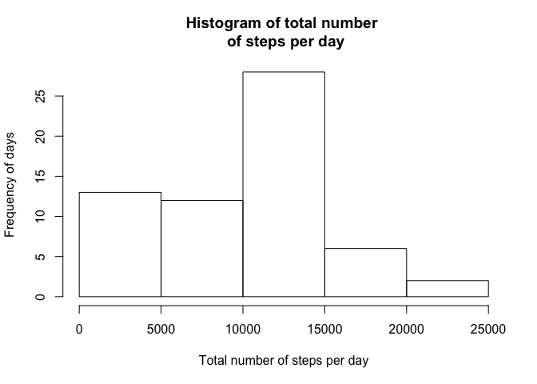
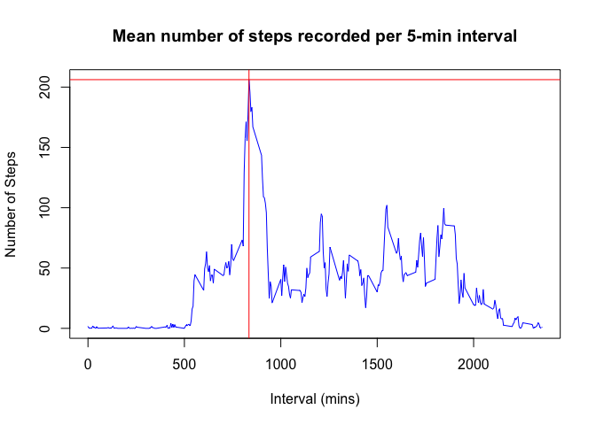

# Reproducible Research: Peer Assessment 1


## Loading and preprocessing the data

Load the activity data from direct from the zip file provided for the assignment.


```r
data <- read.csv(unz("activity.zip", "activity.csv"))
# convert date from factor to POSIXlt
data$date <- as.POSIXct(strptime(data$date, format="%Y-%m-%d"))
# add weekdays column for later analysis
data$weekday <- weekdays(data$date)
```

## What is mean total number of steps taken per day?

With the help of the dplyr package - the following calculates the mean, median, and sum of the steps recorded per day.

As stated in assignment - null values can be ignored for now - so I have removed them.


```r
library(dplyr)

data.smy1 <- tbl_df(data) %>% 
                group_by(date) %>%
                summarise_at("steps", funs(sum(.,na.rm=TRUE)))
```

Lets take a look at the distribution of the total number of steps taken each day (sum).


```r
with(data.smy1, 
     hist(steps, 
          main="Histogram of total number \n of steps per day", 
          xlab="Total number of steps per day",
          ylab="Frequency of days")
     )
```

<!-- -->

and lets get the median and mean of the total number of steps taken per day


```r
data.smy1.mean <- mean(data.smy1$steps)
data.smy1.median <- median(data.smy1$steps)
```

The mean is [9354.2295082] and the median is [10395]. 

## What is the average daily activity pattern?

Ok lets get the data into shape for plotting interval against steps. 

Using the dplyr package I will group by interval and take the mean number of steps recorded for that interval across the all the readings (from 2012-11-30 to 2012-10-01).


```r
data.smy2 <- tbl_df(data) %>% 
                group_by(interval) %>% 
                summarise_at("steps", funs(mean(.,na.rm=TRUE)))
```

The data above is plotted onto the figure below.


```r
with(data.smy2, 
     {
             plot(x=interval,
                  y=steps, 
                  type="l",
                  col="blue", 
                  xlab="Interval (mins)",
                  ylab="Number of Steps",
                  main="Mean number of steps recorded per 5-min interval"
             )
     })

data.smy2.maxline <- data.smy2[order(data.smy2$steps, decreasing=TRUE)[1],]
abline(h=data.smy2.maxline$steps, col="red")
abline(v=data.smy2.maxline$interval, col="red")
```

<!-- -->


As can be seen on the chart the interval with the maximum mean number of steps taken is [206.1698113] from interval [835].

## Imputing missing values

Looking at the summary for the activity dataset we can see there are a few missing values (NA's) within the steps variable.


```r
knitr::kable(summary(data))
```

         steps             date                        interval        weekday        
---  ---------------  ----------------------------  ---------------  -----------------
     Min.   :  0.00   Min.   :2012-10-01 00:00:00   Min.   :   0.0   Length:17568     
     1st Qu.:  0.00   1st Qu.:2012-10-16 00:00:00   1st Qu.: 588.8   Class :character 
     Median :  0.00   Median :2012-10-31 00:00:00   Median :1177.5   Mode  :character 
     Mean   : 37.38   Mean   :2012-10-30 23:32:27   Mean   :1177.5   NA               
     3rd Qu.: 12.00   3rd Qu.:2012-11-15 00:00:00   3rd Qu.:1766.2   NA               
     Max.   :806.00   Max.   :2012-11-30 00:00:00   Max.   :2355.0   NA               
     NA's   :2304     NA                            NA               NA               

A simple approach is taken to replace missing values within the data-set. First the average (mean) interval value is calculated. The results of this calculation will replace the missing values within the original dataset.


```r
data.calc <- tbl_df(data) %>% 
                        group_by(interval) %>%
                        summarise_at("steps", funs(mean(.,na.rm=TRUE)))
                
# loop through the NA values and assign new value
data.imp <- data
data.imp[is.na(data.imp$steps),]$steps <- sapply(data.imp[is.na(data.imp$steps),]$interval, 
                                                        function(x){
                                                                return(data.calc$steps[which(data.calc$interval==x)])
                                                        })

knitr::kable(summary(data.imp))
```

         steps             date                        interval        weekday        
---  ---------------  ----------------------------  ---------------  -----------------
     Min.   :  0.00   Min.   :2012-10-01 00:00:00   Min.   :   0.0   Length:17568     
     1st Qu.:  0.00   1st Qu.:2012-10-16 00:00:00   1st Qu.: 588.8   Class :character 
     Median :  0.00   Median :2012-10-31 00:00:00   Median :1177.5   Mode  :character 
     Mean   : 37.38   Mean   :2012-10-30 23:32:27   Mean   :1177.5   NA               
     3rd Qu.: 27.00   3rd Qu.:2012-11-15 00:00:00   3rd Qu.:1766.2   NA               
     Max.   :806.00   Max.   :2012-11-30 00:00:00   Max.   :2355.0   NA               

The change can be seen with the output from 'Summary' above. There is a change to the 3rd Quandrant value.

Lets see the imputed data in a histogram.


```r
data.imp.smy1 <- tbl_df(data.imp) %>% 
                group_by(date) %>%
                summarise_at("steps", funs(sum(.,na.rm=TRUE)))


with(data.imp.smy1, 
     hist(steps, 
          main="Imputed data - Histogram of total number \n of steps per day", 
          xlab="Total number of steps per day",
          ylab="Frequency of days")
     )
```

<!-- -->


and lets get the median and mean of the total number of steps taken per day


```r
data.imp.smy1.mean <- mean(data.imp.smy1$steps)
data.imp.smy1.median <- median(data.imp.smy1$steps)
```

The mean is [1.0766189\times 10^{4}] and the median is [1.0766189\times 10^{4}]. 


## Are there differences in activity patterns between weekdays and weekends?

The following code generates a histogram for steps taken on weekdays and steps taken on weekends.


```r
data.ss.wkend <- grep("S[unday|aturday]", weekdays(data$date))
data.ss.wkend <- data[data.ss.wkend,]

data.ss.wkend.smy <- data.ss.wkend %>%
                        group_by(interval) %>%
                        summarise_at("steps", funs(mean(.,na.rm=TRUE)))

data.ss.wkday <- grep("Monday|Tuesday|Wednesday|Thursday|Friday", weekdays(data$date))
data.ss.wkday <- data[data.ss.wkday,]

data.ss.wkday.smy <- data.ss.wkday %>%
                        group_by(interval) %>%
                        summarise_at("steps", funs(mean(.,na.rm=TRUE)))

par(mfrow=c(2,1), oma=c(0,0,0,0), mar=c(3,2,1.5,0.5))

with(data.ss.wkday.smy, 
     {
             plot(x=interval,
                  y=steps, 
                  type="l",
                  col="blue", 
                  xlab="Interval (mins)",
                  ylab="Number of Steps",
                  main="Weekday"
             )
     })

with(data.ss.wkend.smy, 
     {
             plot(x=interval,
                  y=steps, 
                  type="l",
                  col="blue", 
                  xlab="Interval (mins)",
                  ylab="Number of Steps",
                  main="Weekend"
             )
     })
```

<!-- -->

The charts shows that there is a difference in activity. On weekdays there is a bigger peak in the morning before leveling off for the rest of the day. On weekends the peak is not as high as week days however there is more activity over a weekend day.


